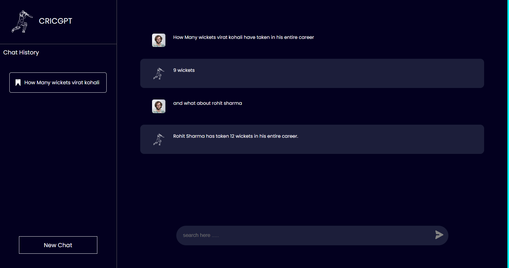

# CricGPT :- Your Virtual Cricket Assistant [Live](https://smart-portfolio-401206.de.r.appspot.com/)[video](https://youtu.be/FRygu3yEf1M?si=bQ51Dt3RmGfkerq0)

Welcome to the CricGPT World! This application is a example of RAG based LLM chatbot where as of now we have provided 15 Indian cricket players data which will get updated every week and we are using GCP vertex AI's chat-bison model as a LLM. Follow the steps below to get started.

## Prerequisites

Before you begin, make sure you have the following prerequisites in place:

- A Google Cloud Platform (GCP) account.
- `gcloud` command-line tool installed and configured with your GCP account.
- Python 3.6+ installed on your system.
- Neo4j Aura local or cloud Instance

1. Clone the repository to your local machine:

   ```bash
   git clone https://github.com/iamdkcoder/CricGPT.git
   cd CricGPT

## If you have docker installed then just follow below command
   - Create .env file and add all the required credentials (refer .env.example)
   - Go to frontend and change the backend api url present in src/components/APiOutput.js
   - Run docker-compose 
      ```
      docker-compose up
      ```

## Backend Setup Instructions (optional)


1. Create Virtual environment
   ```bash
   python -m venv env

2. Activate virtual environment
   ```bash
   source env/Scripts/activate

3. Install dependencies
   ```bash
   pip install -r requirements.txt

4. Replace all the credentials with your own credentials in chat.py

   1. GOOGLE_APPLICATION_CREDENTIALS (make sure you have created service account IAM keys in your gcp account)

   2. neo4j credentials
      - url
      - username
      - password

5. Run chat.py
   ```bash
   uvicorn chat:app --reload

## Frontend Setup Instructions (optional)
1. change directory to frontend

   ```
   cd frontend
   ```
2. install the dependencies

   ```
   npm install
   ```

3. change the backend api url present in src/components/APiOutput.js

4. Start the app
   ```
   npm start
   ```